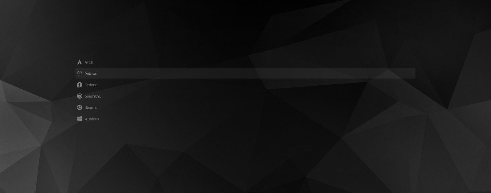

# dotfiles

:wrench: dotfiles for ubuntu

## Installation

:warning: Backup your current dotfiles, otherwise launching the installation script _will override them_!

```bash
git clone https://github.com/devmatteini/dotfiles.git && cd dotfiles && ./bootstrap.sh
```

The [`bootstrap.sh`](bootstrap.sh) script does:

- create symlinks for:
  1. [`bash`](bash/) shell files
  2. [`git`](git/) files
  3. config files ([`~/.config`](config/))
  4. custom [`scripts`](scripts/) in `~/.local/bin`
- if using `gnome-terminal`, it will load the [`gnome-terminal.dconf`](gnome-terminal.dconf) configuration file

## Prompt

Currently using [`starship`](https://github.com/starship/starship/) as bash prompt.
You can customize it by editing [`config/starship.toml`](config/starship.toml)

Alternatively you can use [`.bash_prompt`](bash/.bash_prompt) instead of `starship`.

## Terminal Emulator

Currently using [`WezTerm`](https://wezfurlong.org/wezterm/index.html).
You can customize it by editing [`config/wezterm/wezterm.lua`](config/wezterm/wezterm.lua)

Alternatively you can use `gnome-terminal`.

## Application

Firstly, install [`dra`](https://github.com/devmatteini/dra) which is used to download and install various apps.

Now you can install basic dependencies:

```bash
# Install basic packages like build-essential, curl (etc) and installs flatpak
./apps/dependencies.sh
```

If you want to install other application:

```bash
./apps/<script>

# List what packages you can install
./apps/tools --list

# Only install some packages
./apps/tools --filter bat,fzf

# Install all packages but exclude some
./apps/tools --exclude aws
```

### :clipboard: List of application script

- browsers (firefox, firefox-dev, chromium)
- docker (docker-ce, docker-compose)
- dotnet (dotnet-sdk-3.1) // OUTDATED
- editors (vscode, rider, vim, intellij-idea)
- fnm (node-v{16,18}, npm, yarn)
- fonts (firacode, firacode nerd font)
- misc (postman, gimp, vlc)
- rust (installation and post install setup)
- tools (fzf, tldr, shellcheck, awscli, bat, ripgrep, ...)

## GRUB Theme

https://github.com/shvchk/poly-dark



## Inspired by

- https://github.com/alrra/dotfiles
- https://github.com/mathiasbynens/dotfiles
- https://github.com/iacoware/dotfiles/
- https://github.com/CoreyMSchafer/dotfiles
